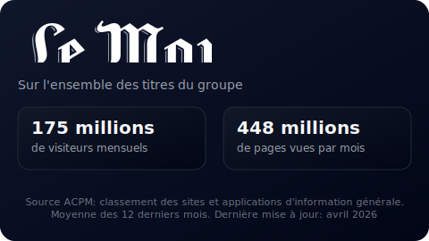

[](https://github.com/TangoMan75/acpm-scraper/releases/)
[](https://github.com/TangoMan75/acpm-scraper/releases/)

[](https://github.com/TangoMan75/acpm-scraper/actions/workflows/ci.yml)
[](https://github.com/TangoMan75/acpm-scraper/actions/workflows/scraper.yml)


acpm-scraper
============


Audience annuelle moyenne des sites du groupe Le Monde
------------------------------------------------------

Extrait les données de trafic du site ACPM et génère des fichiers JSON et SVG pour analyse.

🚀 Fonctionnalités
------------------

### ⚡ Collecte de données

1. **[Extraction ACPM]:** Extrait les données de trafic du site ACPM pour les médias français.
2. **[Support multi-sites]:** Collecte les données pour Le Monde, Nouvel Observateur, Télérama, Courrier International et Le Monde Diplomatique.
3. **[Métriques annuelles]:** Calcule les pages vues et visites moyennes mensuelles sur les douze derniers mois.

### ⚡ Automatisation

1. **[Exécutions planifiées]:** S'exécute automatiquement le 1er de chaque mois à minuit (CRON: `0 0 1 * *`).
2. **[Déclenchement manuel]:** Utiliser `workflow_dispatch` pour exécuter à la demande depuis l'interface GitHub Actions.
3. **[Commit intelligent]:** Ne commit que si les données ont changé; ignore les commits redondants.

📡 Documentation API
--------------------

Le scraper génère les données suivantes:

1. **Données JSON:** `docs/stats.json` - Contient les métriques par site (visites moyennes, pages moyennes, horodatages)
2. **Visualisations SVG:** `docs/{site_id}-{theme}.svg` - Représentation graphique des métriques
3. **Analyse de groupe:** `docs/lemonde-group-{theme}.svg` - Données combinées pour tous les sites

exemple:



### 🌐 GitHub Pages

Les résultats générés sont déployés sur GitHub Pages et sont toujours à jour avec les dernières données disponibles:

- **Tableau de bord en direct:** [https://tangoman75.github.io/acpm-scraper](https://tangoman75.github.io/acpm-scraper)

Les SVGs générés peuvent être liées directement depuis vos projets:

```html


```

Thèmes SVG disponibles: `-light` (fond clair) et `-dark` (fond sombre).

📦 Installation
---------------

1. **Cloner le dépôt:** Cloner le dépôt acpm-scraper sur votre machine locale.
2. **Installer les dépendances:** Exécuter `npm install` pour installer les dépendances du projet.
3. **Vérifier la configuration:** Exécuter `npm run lint` pour vérifier la syntaxe.

🛠️ Utilisation
---------------

1. **Exécuter localement:** Exécuter `npm run scrape` pour extraire les données ACPM.
2. **Consulter les résultats:** Vérifier le répertoire `docs/` pour les fichiers JSON et SVG générés.
3. **GitHub Actions:** Le scraper s'exécute automatiquement selon le planning ou peut être déclenché manuellement.

🖇️ Dépendances / Configuration requise
--------------------------------------

**acpm-scraper** nécessite les dépendances suivantes:

1. Node.js v22.
2. jsdom (^29.0.2).
3. NPM.

🐞 Dépannage
------------

1. **Erreurs de syntaxe:** Exécuter `npm run lint` pour vérifier les erreurs de syntaxe.
2. **Échec des tests:** Exécuter `npm test` pour exécuter les tests unitaires.
3. **Journaux d'actions:** Consulter les journaux GitHub Actions pour les messages d'erreur détaillés.

🧪 Stratégie de test
--------------------

1. **Exécuter tous les tests:** Exécuter `npm test` pour exécuter tous les tests unitaires.
2. **Vérifier la sortie:** Vérifier les fichiers JSON et SVG générés dans le répertoire `docs/`.
3. **Pipeline CI:** GitHub Actions exécute les tests automatiquement à chaque push sur la branche `main`.

🐛 Limitations
--------------

1. ⚠️ **Disponibilité des sites:** Certains sites peuvent être indisponibles pendant l'extraction; ceux-ci sont journalisés et ignorés.
2. ⚠️ **Latence des données:** Les données ACPM peuvent avoir un retard de plusieurs jours après la fin du mois.
3. ⚠️ **Limitation de débit:** Les demandes excessives peuvent déclencher une limitation de débit de la part des serveurs ACPM.

📝 Notes
--------

Ce projet est conçu pour s'exécuter en tant que GitHub Action avec une planification mensuelle automatique.

🤝 Contribution
---------------

Merci pour votre intérêt à contribuer à **acpm-scraper**.

Veuillez consulter le [code de conduite](./CODE_OF_CONDUCT.md) et les [directives de contribution](./CONTRIBUTING.md) avant de commencer à travailler sur des fonctionnalités.

Si vous souhaitez ouvrir un problème, veuillez d'abord vérifier s'il n'a pas déjà été [rapporté](https://github.com/%5BTangoMan75%5D/%5Bacpm-scraper%5D/issues) avant d'en créer un nouveau.

📜 Licence
----------

Copyrights (c) 2026 "Matthias Morin" <mat@tangoman.io>

[](LICENSE)
Distribué sous la licence MIT.

Si vous appréciez **acpm-scraper**, veuillez mettre une étoile, suivre ou tweeter:

[](https://github.com/TangoMan75/acpm-scraper/stargazers)
[](https://github.com/TangoMan75)
[](https://twitter.com/intent/tweet?text=Wow:&url=https%3A%2F%2Fgithub.com%2FTangoMan75%2Facpm-scraper)

🙏 Remerciements
----------------

- **[ACPM]:** Pour rendre disponible les données de trafic des différents médias français.
- **[jsdom]:** Pour permettre la manipulation du DOM dans Node.js.
- **[GitHub Actions]:** Pour permettre les workflows automatisés.

👋 Construisons votre prochain projet ensemble !
------------------------------------------------

Code propre. Communication efficace.

De l'idée au déploiement, je suis là pour vous accompagner.

[](https://tangoman.io)